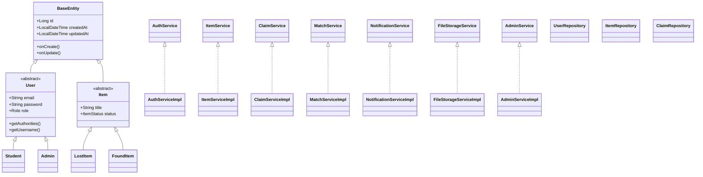

# Class Diagram - Retrievr

```mermaid
classDiagram
  class BaseEntity {
    +Long id
    +LocalDateTime createdAt
    +LocalDateTime updatedAt
    +onCreate()
    +onUpdate()
  }
  class User {
    <<abstract>>
    +String email
    +String password
    +Role role
    +getAuthorities()
    +getUsername()
  }
  class Student
  class Admin
  class Item {
    <<abstract>>
    +String title
    +ItemStatus status
  }
  class LostItem
  class FoundItem
  class AuthService
  class AuthServiceImpl
  class ItemService
  class ItemServiceImpl
  class ClaimService
  class ClaimServiceImpl
  class MatchService
  class MatchServiceImpl
  class NotificationService
  class NotificationServiceImpl
  class FileStorageService
  class FileStorageServiceImpl
  class AdminService
  class AdminServiceImpl
  class UserRepository
  class ItemRepository
  class ClaimRepository
  BaseEntity <|-- User
  BaseEntity <|-- Item
  User <|-- Student
  User <|-- Admin
  Item <|-- LostItem
  Item <|-- FoundItem
  AuthService <|.. AuthServiceImpl
  ItemService <|.. ItemServiceImpl
  ClaimService <|.. ClaimServiceImpl
  MatchService <|.. MatchServiceImpl
  NotificationService <|.. NotificationServiceImpl
  FileStorageService <|.. FileStorageServiceImpl
  AdminService <|.. AdminServiceImpl
```
